### Hi, I'm Alex McAvoy 👋

A developer form Chian.

<ul style="margin: 2em 0 0; padding: 0.5em 1em; border-left: 3px solid #99FF99; background-color: #f9f9f9;">
  <li style="white-space:nowrap;">
    :orange_book: I’m currently learning Data Analyse, Python .etc
  </li>
  <li style="white-space:nowrap;">
    💬 How to contact with: Please contact me with issues
  </li>
  <li style="white-space:nowrap;">
    🌱 My homepage: https://alex-mcavoy.github.io/ and https://blog.csdn.net/u011815404
  </li>
</ul>

### Languages & Tools: ✨
C++、Python、Java

<!--
Here are some ideas to get you started:
- 🔭 I’m currently working on ...
- 👯 I’m looking to collaborate on ...
- 🤔 I’m looking for help with ...
- 📫 How to reach me: ...
- 😄 Pronouns: ...
- ⚡ Fun fact: ...
- :hammer: Creator of applications and frameworks
- :ram: Founder the ObjCCN
- :meat_on_bone: Meat lover
-->

